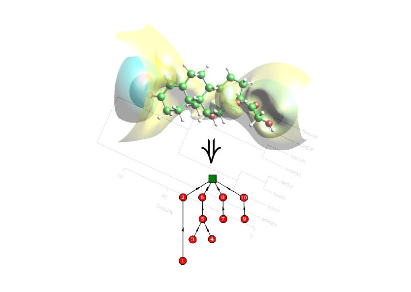

# TARIS
TARIS (Tree Analysis and Representation of Isopotential Surfaces) is a software package designed for molecular similarity purposes in the field of Computational Chemistry. Users are allowed to compare molecules through their molecular electrostatic potentials (MEP) loading .cube files according to the GAUSSIAN format. TARIS performs a geometrical and topological analysis of the  MEP for each molecule going through a potential scan. 

In addition to the .cube file, the user must provide the minimum and maximum cutoffs as well as the stepsize for the potential scanning. This information is encoded in a rooted tree where the nodes are weighted by positive real numbers. In order to compute a dissimilarity measure among molecules, a tree edit distance measure has been implemented.  TARIS output returns the distance matrix, the maximum distance in the whole molecular set and the similarity matrix (derived from the distance matrix). 

The whole code is written in C++ and has been tested in gcc and intel compilers and it works in any UNIX based platform.

More information: http://taris.sourceforge.net

## Installing TARIS

Download the .zip file from this page and extract the files,
```
$ unzip taris-master.zip 
Archive:  taris-master.zip
d7eb234be17dab6ecdb6c199e8ed865b7dddfc9f
   creating: taris-master/
  inflating: taris-master/CMakeLists.txt  
  inflating: taris-master/INSTALL    
  inflating: taris-master/LICENSE    
...

$ mv taris-master master
```
or clone the repository using git
```
$ git clone https://github.com/nfaguirrec/taris.git
```
The following should be the content of the TARIS directory if previous steps were successful:
```
$ cd taris
$ ls
bin  CMakeLists.txt  deps  LICENSE  LICENSE.Molekel  README.md  src  taris.jpeg
```

First, it is neccessary to install GTL (Graph Template Library):
```
$ git clone https://github.com/rdmpage/graph-template-library.git
$ cd graph-template-library/
$ ./configure --prefix=`realpath ../deps/`
$ make
$ make install
```

To build the code just type cmake inside the main directory as follows:
```
$ cmake .
<TARIS_DIR>/src/taris/deps/lib/libGTL.so
-- Configuring done
-- Generating done
-- Build files have been written to: <TARIS_DIR>/src/taris
```

## Installing TARIS

The basic environmental variables that TARIS needs can be loaded just adding the following command anywhere in the ~/.bashrc file:

```
source <PATH_TO_TARIS>/TARISvars.sh
```

# Authors
* Néstor F. Aguirre ( nfaguirrec@unal.edu.co, nfaguirrec@gmail.com )
* Ray M. Marín ( rmmarinf@unal.edu.co )
* Edgar E. Daza C. ( eedazac@unal.edu.co )

## Citing

[](https://zenodo.org/badge/latestdoi/91266409)

1. Graph Theoretical Similarity Approach To Compare Molecular Electrostatic Potentials.<br/>
   Ray M. Marín, Nestor F. Aguirre, and Edgar E. Daza<br/>
   [*J. Chem. Inf. Model.*, **48**, 109 (2008)](https://pubs.acs.org/doi/10.1021/ci7001878)


